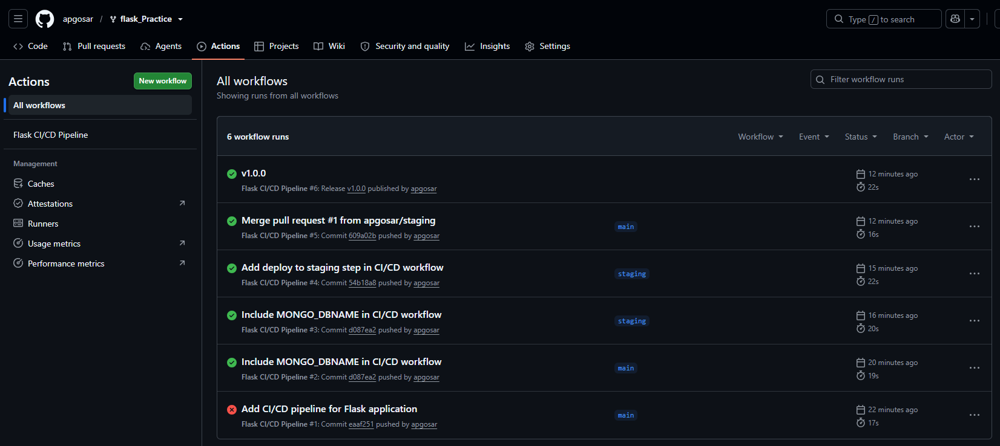
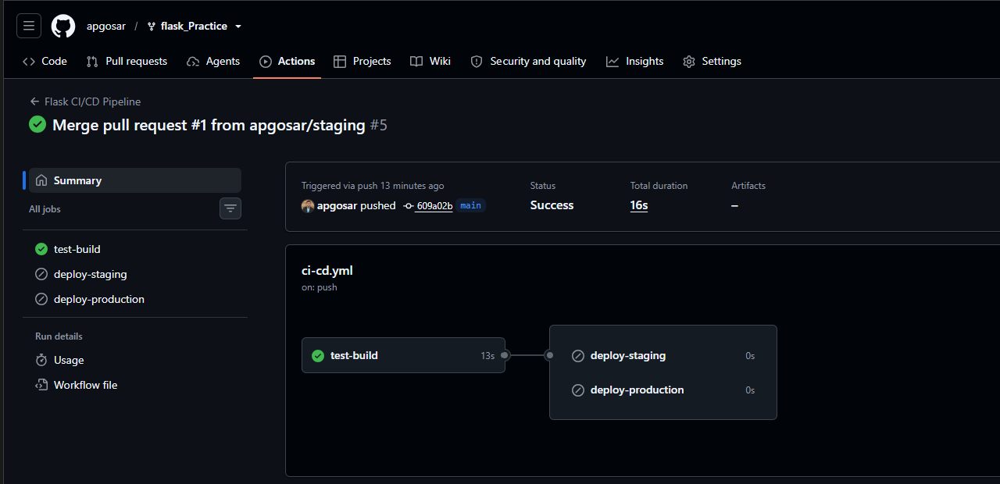
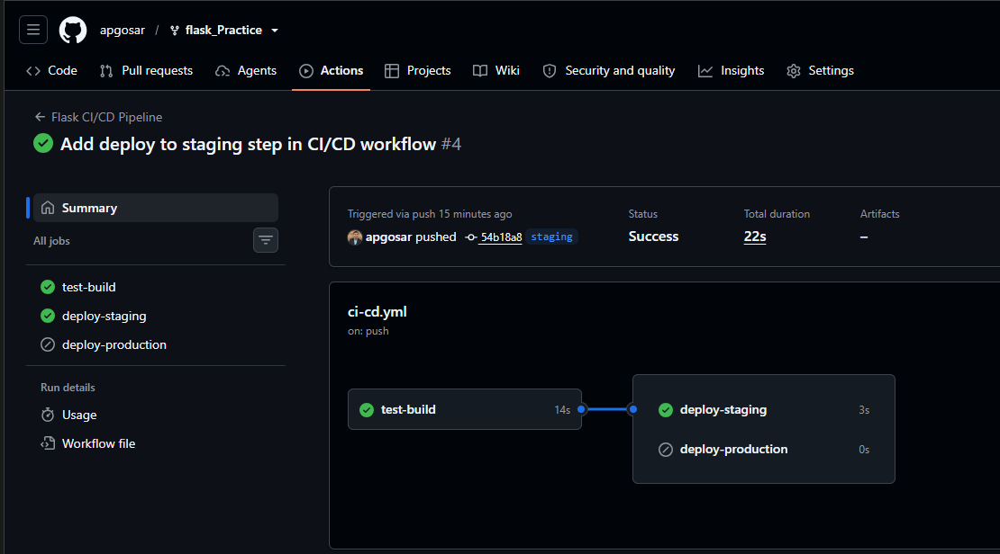
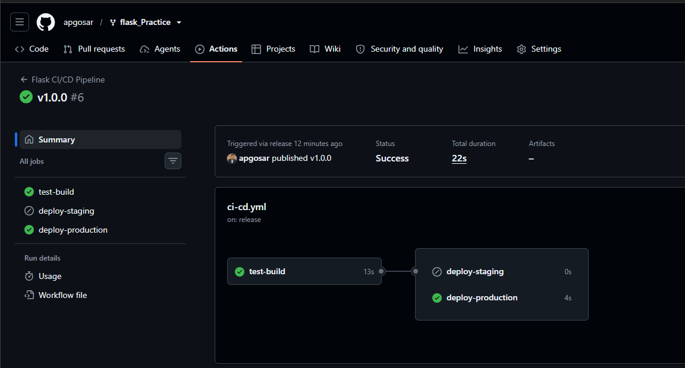

# GitHub Actions — `ci-cd.yml` README

### Purpose
- Documents the GitHub Actions workflow defined at `.github/workflows/ci-cd.yml` and how to run or test it locally.

### Location
- `.github/workflows/ci-cd.yml`

## Workflow summary
- Name: `Flask CI/CD Pipeline`
- Triggers:
  - `push` to branches `main` and `staging`
  - `release` event when a release is published

## Jobs
1. test-build
   - Runs on `ubuntu-latest`.
   - Steps:
     - Checkout repository
     - Setup Python (3.12)
     - Install dependencies from `requirements.txt`
     - Run tests (uses repository secrets for DB connection)
     - Prepare a `build/` folder with application files
   - Environment variables required during test:
     - `MONGO_URI` (set in GitHub Secrets)
     - `SECRET_KEY` (set in GitHub Secrets)
     - `MONGO_DBNAME` (set in GitHub Secrets)

2. deploy-staging
   - Runs only when the branch is `staging` (conditional via `if`).
   - Depends on `test-build` (`needs: test-build`).
   - Uses a secret `DEPLOY_KEY` for deployment actions.

3. deploy-production
   - Runs on `release` events (when a GitHub Release is published).
   - Depends on `test-build`.
   - Uses a secret `API_TOKEN` for deployment actions.

## Required GitHub secrets
- `MONGO_URI` — MongoDB connection string
- `SECRET_KEY` — Application secret key
- `MONGO_DBNAME` — Name of the database used by the app
- `DEPLOY_KEY` — (optional) deploy key for staging
- `API_TOKEN` — (optional) token for production deployment

## Github Actions Execution Screenshots

## Local testing
- The workflow executes standard Python commands; to test locally:
  1. Create a `.env` file or export the required environment variables:

     MONGO_URI=<your-mongo-uri>
     SECRET_KEY=<your-secret>
     MONGO_DBNAME=student_db

  2. Create and activate a Python virtual environment and install requirements:

     python -m venv venv
     ### Windows
     venv\Scripts\activate
     ### macOS / Linux
     source venv/bin/activate

     python -m pip install --upgrade pip
     python -m pip install -r requirements.txt

  3. Run tests locally:

     python -m pytest -v

- To simulate GitHub Actions locally you can use `nektos/act` (Docker required). Map secrets as environment variables or use `--secret` args with `act`.

## Notes & recommendations
- Keep secrets in GitHub repository or organization secrets — do not commit them to source control.
- Consider adding caching for pip packages (actions/cache) to speed up CI runs.
- The `Build` and `Deploy` steps are simple file-copy flows and may need to be replaced with real deployment steps such as building a Docker image, pushing to a registry, or running remote deployment commands.
- Use matrix jobs if you want to test on multiple Python versions or OSes.

## Troubleshooting
- If tests fail in CI but pass locally, ensure the same Python version and dependencies are used and that secrets are present in the GitHub job environment.
- For networked services (MongoDB Atlas), ensure IP access or allowed network configuration for the runner, or use a test/mocked DB for CI runs.

## Contact
- For workflow changes, edit `.github/workflows/ci-cd.yml` and open a PR for review.