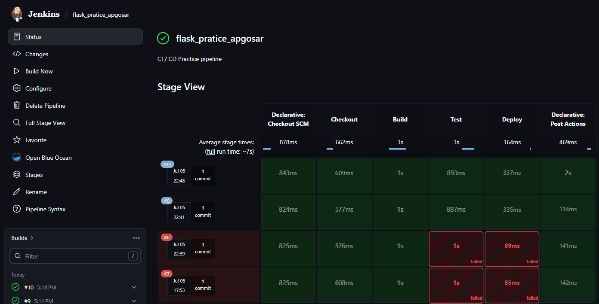
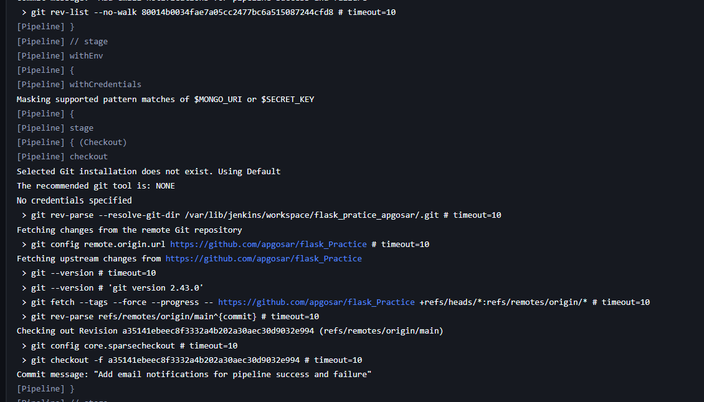
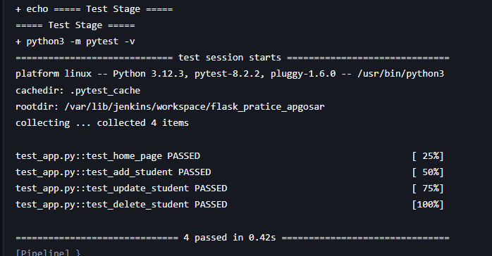
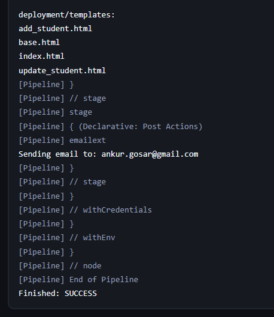

# Jenkinsfile — README

### Purpose
- Documents the Jenkins pipeline defined in `Jenkinsfile` and how to run it.

### Location
- `Jenkinsfile` (project root)

### Pipeline overview
- agent: `any` — uses any available Jenkins agent.
- environment: Jenkins credentials are injected into the build as environment variables:
  - `apgosar-mongo-uri` → `MONGO_URI`
  - `apgosar-mongo-secret-key` → `SECRET_KEY`

### Stages
1. Checkout
   - Checks out the repository using `scm`.

2. Build
   - Creates a `.env` file from the Jenkins credentials.
   - Upgrades `pip` and installs dependencies from `requirements.txt`.

3. Test
   - Runs `pytest` (`python3 -m pytest -v`).

4. Deploy
   - Prepares a `deployment/` folder and copies the application files (`app.py`, `requirements.txt`, `README.md`, and `templates/`).
   - This is a simple file-copy deployment step and should be adapted to your real deploy target (e.g., Docker image, server copy, or cloud service).

Post-build
- On success/failure, the pipeline sends an email using the Jenkins Email Extension (`emailext`) plugin to the configured recipient.

### Required Jenkins setup
- Add credentials (type: Secret text or Username/Password depending on how you store them):
  - ID `apgosar-mongo-uri` containing the MongoDB connection string.
  - ID `apgosar-mongo-secret-key` containing the app secret.
- Ensure the Jenkins node/agent has Python 3 and required build tools installed.
- Install `Email Extension` plugin for `emailext` support if notifications are desired.

## Jenkins exection screenshots





### Local testing and running notes
- To run locally (without Jenkins), create a `.env` file in the project root with the required values:

```
MONGO_URI=<your-mongo-uri>
SECRET_KEY=<your-secret>
MONGO_DBNAME=student_db
```

- Create and activate a Python virtual environment, then install requirements:

```bash
python -m venv venv
# Windows
venv\Scripts\activate
# macOS / Linux
source venv/bin/activate

python -m pip install --upgrade pip
python -m pip install -r requirements.txt
```

- Run tests:

```bash
python -m pytest -v
```

- Run the app locally:

```bash
python app.py
```

## Security notes
- Do NOT commit credentials or `.env` to source control.
- Use Jenkins credentials store to keep secrets out of the pipeline logs.

## Customizing deployment
- The current `Deploy` stage simply copies files into a `deployment` directory. Replace that block with your actual deployment steps (e.g., build Docker image, push to registry, SSH/scp to server, or call cloud provider deploy).

## Troubleshooting
- If the pipeline fails at the Build or Test stage, check the console output for dependency or test errors.
- If `MONGO_URI` is not set or invalid, the application will fail to initialize — ensure the Jenkins credentials are configured and mapped correctly.

## Contact
- For pipeline issues, contact the repository owner or the person listed in the Jenkins `emailext` notifications.
